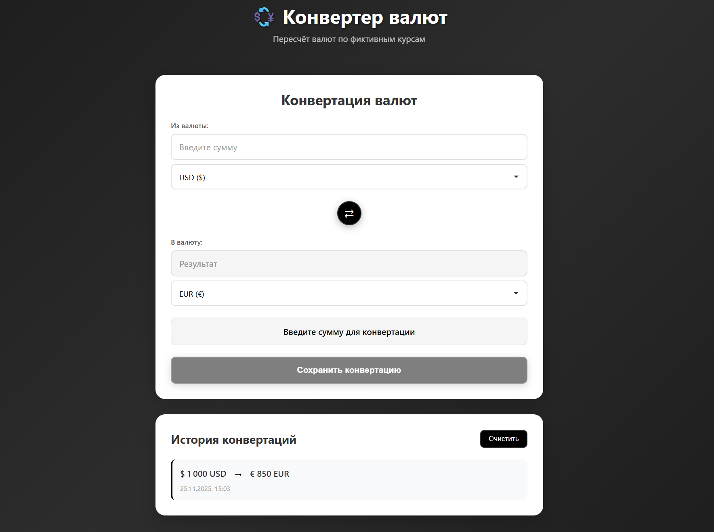
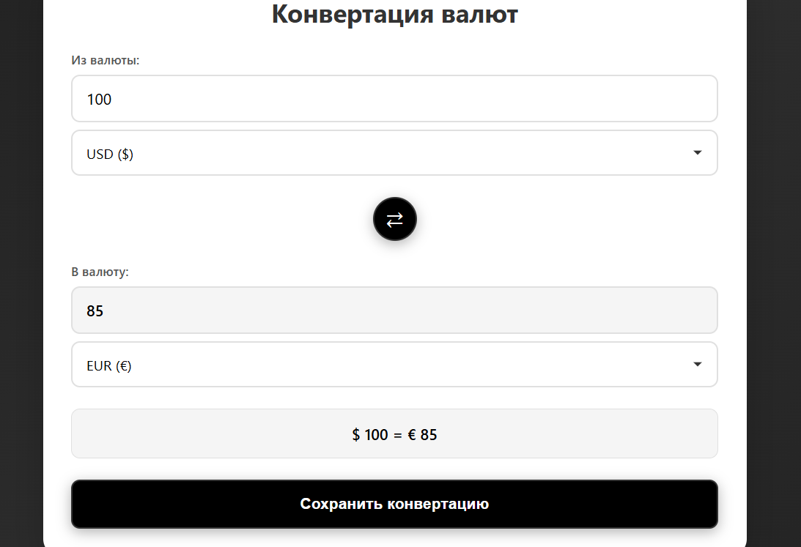
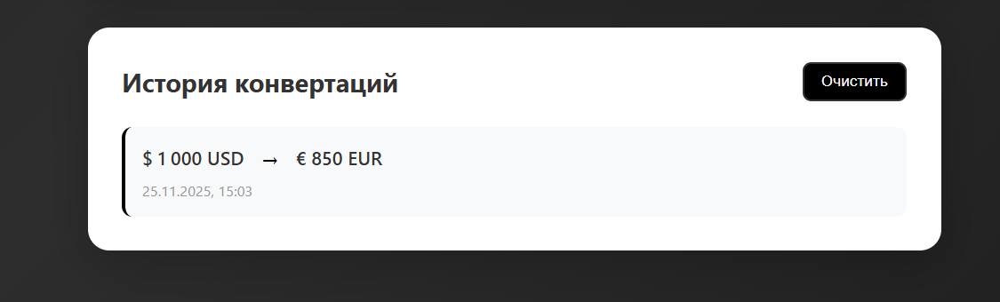
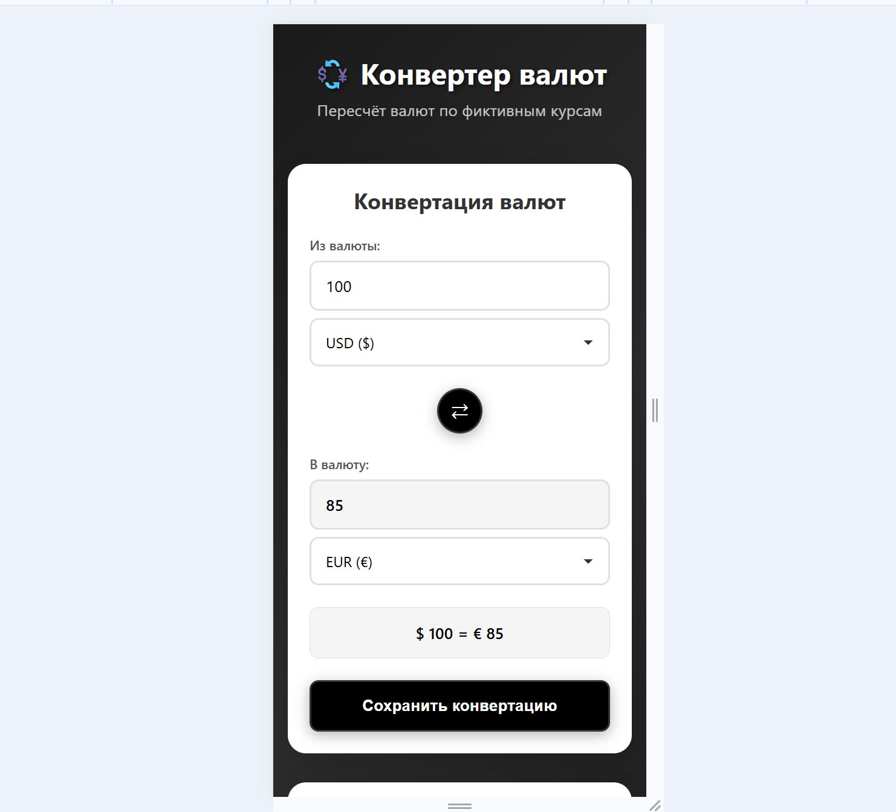

# 💱 Конвертер валют

React-приложение для конвертации валют с использованием фиктивных курсов валют.

## 📋 Описание

Конвертер валют — это полнофункциональное React-приложение, которое позволяет пользователям конвертировать различные валюты по заранее заданным фиктивным курсам. Приложение демонстрирует работу с компонентами, состоянием, событиями, а также использует localStorage для хранения истории конвертаций.

## ✨ Основные возможности

- **Конвертация валют**: Пересчёт между 10 различными валютами (USD, EUR, GBP, JPY, RUB, CNY, CHF, AUD, CAD, INR)
- **Интерактивный интерфейс**: Удобный и современный пользовательский интерфейс с градиентным дизайном
- **Обмен валют**: Быстрый обмен валют местами одной кнопкой
- **История конвертаций**: Сохранение истории выполненных конвертаций в localStorage
- **Адаптивный дизайн**: Полная поддержка мобильных устройств и планшетов
- **Валидация ввода**: Проверка корректности вводимых данных

## 🚀 Технологии

- **React 18.2.0** — библиотека для создания пользовательских интерфейсов
- **React Scripts 5.0.1** — инструменты для разработки и сборки
- **CSS3** — современные стили с градиентами и анимациями
- **localStorage API** — хранение данных в браузере

## 📦 Установка и запуск

### Предварительные требования

- Node.js (версия 14.0.0 или выше)
- npm (версия 6.0.0 или выше)

### Установка зависимостей

```bash
npm install
```

### Запуск приложения в режиме разработки

```bash
npm start
```

Приложение откроется в браузере по адресу [http://localhost:3000](http://localhost:3000)

### Сборка для продакшена

```bash
npm run build
```

Собранные файлы будут находиться в папке `build/`

## 🏗️ Структура проекта

```
currency-converter/
├── public/
│   └── index.html          # HTML шаблон
├── src/
│   ├── components/         # React компоненты
│   │   ├── CurrencyConverter.js      # Главный компонент конвертера
│   │   ├── CurrencyConverter.css
│   │   ├── CurrencyInput.js          # Компонент ввода суммы
│   │   ├── CurrencyInput.css
│   │   ├── CurrencySelect.js         # Компонент выбора валюты
│   │   ├── CurrencySelect.css
│   │   ├── ConversionHistory.js      # Компонент истории конвертаций
│   │   └── ConversionHistory.css
│   ├── utils/              # Утилиты
│   │   ├── currencyRates.js # Фиктивные курсы валют и функции конвертации
│   │   └── storage.js      # Работа с localStorage
│   ├── App.js              # Главный компонент приложения
│   ├── App.css             # Стили главного компонента
│   ├── index.js            # Точка входа
│   └── index.css           # Глобальные стили
├── package.json            # Зависимости и скрипты
├── .gitignore             # Игнорируемые файлы
└── README.md              # Документация
```

## 🎯 Особенности реализации

### Компоненты

1. **CurrencyConverter** — главный компонент, управляющий состоянием конвертации
   - Использует хуки `useState` и `useEffect` для управления состоянием
   - Обрабатывает события изменения валют и суммы
   - Сохраняет конвертации в историю

2. **CurrencyInput** — компонент ввода суммы
   - Валидация ввода (только числа и десятичные дроби)
   - Поддержка режима только для чтения для результата

3. **CurrencySelect** — компонент выбора валюты
   - Выпадающий список с символами валют

4. **ConversionHistory** — компонент истории конвертаций
   - Отображение сохранённых конвертаций
   - Возможность очистки истории

### Управление состоянием

- Локальное состояние компонентов через `useState`
- Синхронизация состояния через `useEffect`
- Хранение данных в localStorage для персистентности

### Хранение данных

- Использование localStorage API для сохранения истории конвертаций
- Автоматическая загрузка истории при монтировании компонента
- Ограничение истории до 50 последних записей

### Фиктивные курсы валют

Курсы валют заданы относительно USD (базовая валюта):
- USD: 1.0
- EUR: 0.85
- GBP: 0.73
- JPY: 110.0
- RUB: 75.0
- CNY: 6.5
- CHF: 0.92
- AUD: 1.35
- CAD: 1.25
- INR: 74.0

Конвертация между валютами происходит через USD как промежуточную валюту.

## 📸 Скриншоты

### Главный экран

*Главный экран с формой конвертации валют*

### Конвертация валют

*Пример конвертации 100 USD в EUR*

### История конвертаций

*История выполненных конвертаций*

### Адаптивный дизайн

*Версия для мобильных устройств*


## 🎨 Дизайн

Приложение использует элегантный черно-белый дизайн с:
- Темным градиентным фоном (оттенки серого и черного)
- Белыми карточками с закруглёнными углами
- Черными акцентами и кнопками
- Плавными анимациями и переходами
- Адаптивной вёрсткой для всех устройств

## 🔧 Использование

1. Введите сумму в поле "Из валюты"
2. Выберите исходную валюту из выпадающего списка
3. Выберите целевую валюту из второго списка
4. Результат конвертации отобразится автоматически
5. Нажмите кнопку "Сохранить конвертацию" для добавления в историю
6. Используйте кнопку ⇄ для быстрого обмена валют местами

## 📝 Выводы

В ходе выполнения контрольной работы было разработано полнофункциональное React-приложение "Конвертер валют", которое демонстрирует:

1. **Работу с компонентами**: Создана модульная структура с переиспользуемыми компонентами
2. **Управление состоянием**: Использованы React хуки для управления состоянием приложения
3. **Обработка событий**: Реализованы обработчики для всех пользовательских действий
4. **Хранение данных**: Использован localStorage для персистентного хранения истории
5. **Архитектура приложения**: Соблюдены принципы разделения ответственности и модульности

